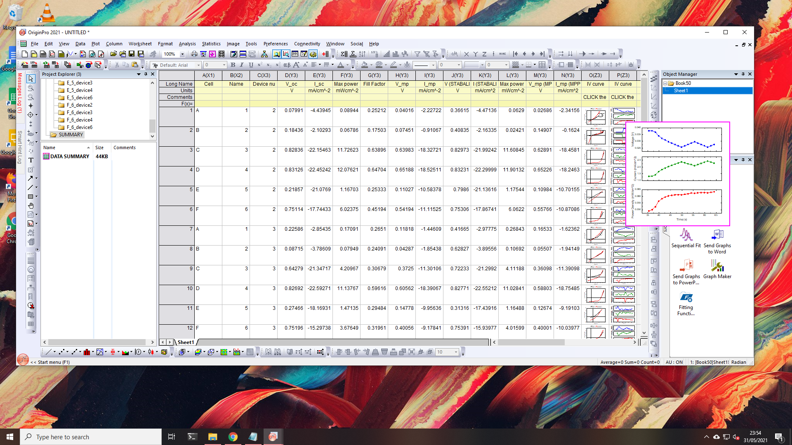
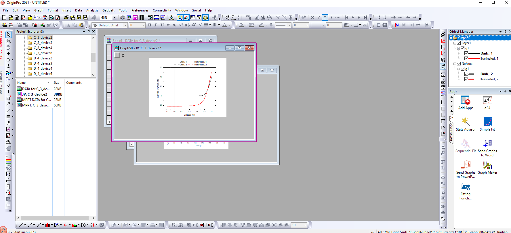

# A^4 (Akashs amazing analysis automation!)

An analysis automation programme, written to process J/V curves of solar cells from data obtained using the 'Wavelabs Solar Simulator, for the Henry J Snaith "Photovoltaic and Optoelectronic Device" Groups at Oxford university. The programme parses data files of the fromat outputed by custom software written by Grey Chhristoforo. Thanks to Grey, Suhas Mahesh, Tino Lukas and Robbie Oliver.

* **For regular users:** The programme comes packedged in an install file. See the installation and useage instructions below.

* **For Advanced users:** The Python file requires the OriginPro module, which lives inside the embedded python environment which gets installed alongside OriginPro. If you want to run the script on its own without install, or wish to edit it you will have to run it through there. There is a required style file (.optu) aswell to make everything look pretty, this is required in the script, but this part can be commented away if required.

## Installation 

* You MUST have Origin version 2021 or higher for this to work! For Oxford Physics users, this version is available on the physics Self Service:

* Download the "install.opx" file. On github, you can download all the code in a zip file, and extract it, to get a folder with the install file:

* Open Origin
* Open the folder with the install file, and drag and drop the file into origin: 

* The App is installed! It will appear on the app bar on the right:

* IMPORTANT: YOU MUST CLOSE AND OPEN THE APP ONCE AFTER INSTALL! Otherwise it dosen't properly update the python package lists.

## Usage

* Click on the app:  

* Enter the path to the data files:  

* There is a summary page with all the important parameters, and links to the J/V curves:

* Clicking on the J/V curves will open the page with the graph and the full data :

* You can return to the summary page from the project explorer: 

